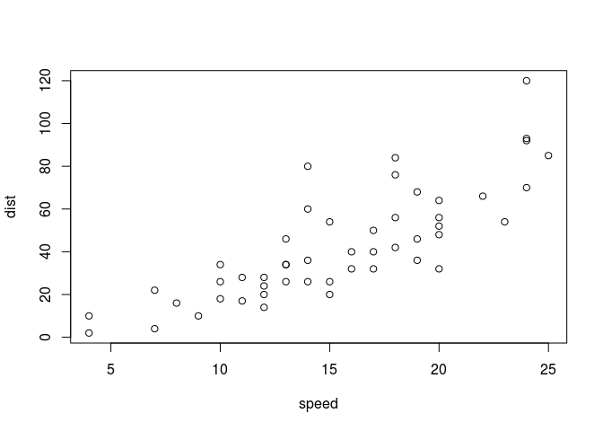

---
author: Daniel Falbel
date: '18-08-2015'
keywords: 'start, introduction, begin, install, build, hello world,'
last_updated: 'August 12, 2015'
output:
  md_document:
    variant: 'markdown+backtick\_code\_blocks-fenced\_code\_attributes'
summary: |
    To get started with this theme, first make sure you have all the
    prerequisites in place; then build the theme following the sample build
    commands. Because this theme is set up for single sourcing projects, it
    doesn't follow the same pattern as most Jekyll projects (which have just
    a \_config.yml file in the root directory).
tags:
- 'getting-started'
title: R como calculadora
...

This is an R Markdown document. Markdown is a simple formatting syntax
for authoring HTML, PDF, and MS Word documents. For more details on
using R Markdown see <http://rmarkdown.rstudio.com>.

When you click the **Knit** button a document will be generated that
includes both content as well as the output of any embedded R code
chunks within the document. You can embed an R code chunk like this:

``` r
summary(cars)
```

    ##      speed           dist       
    ##  Min.   : 4.0   Min.   :  2.00  
    ##  1st Qu.:12.0   1st Qu.: 26.00  
    ##  Median :15.0   Median : 36.00  
    ##  Mean   :15.4   Mean   : 42.98  
    ##  3rd Qu.:19.0   3rd Qu.: 56.00  
    ##  Max.   :25.0   Max.   :120.00

You can also embed plots, for example:



Note that the `echo = FALSE` parameter was added to the code chunk to
prevent printing of the R code that generated the plot.
